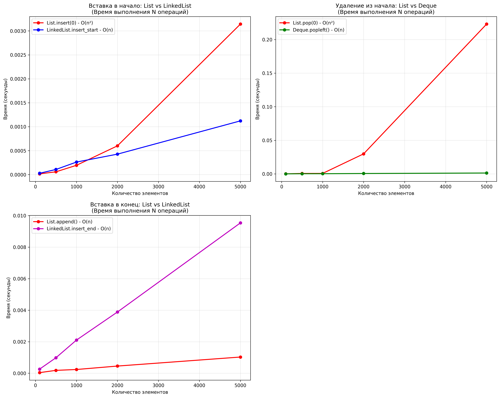

## Отчет к лабораторной работе № 2   
---
**Дата:** 2025-10-06  
**Семестр:** 3 курс 1 полугодие - 5 семестр  
**Группа:** ПИЖ-б-о-23-1  
**Дисциплина:** Анализ сложности алгоритмов   
**Студентка:** Журавлева Софья Витальевна   
**Репозиторий Git:** https://github.com/lookitsssonya/pizh2311-zhuravleva  
---
## Цель работы:
Изучить понятие и особенности базовых абстрактных типов данных (стек, очередь, дек,
связный список) и их реализаций в Python. Научиться выбирать оптимальную структуру данных для
решения конкретной задачи, основываясь на анализе теоретической и практической сложности
операций. Получить навыки измерения производительности и применения структур данных для
решения практических задач.
---
## Теория (кратко):  
**Список (list) в Python:** Реализация динамического массива. Обеспечивает амортизированное
время O(1) для добавления в конец (append). Вставка и удаление в середину имеют сложность
O(n) из-за сдвига элементов. Доступ по индексу - O(1).   
**Связный список (Linked List):** Абстрактная структура данных, состоящая из узлов, где каждый
узел содержит данные и ссылку на следующий элемент. Вставка и удаление в известное место
(например, начало списка) выполняются за O(1). Доступ по индексу и поиск - O(n).   
**Стек (Stack):** Абстрактный тип данных, работающий по принципу LIFO (Last-In-First-Out).
Основные операции: push (добавление, O(1)), pop (удаление с вершины, O(1)), peek (просмотр
вершины, O(1)). В Python может быть реализован на основе списка.   
**Очередь (Queue):** Абстрактный тип данных, работающий по принципу FIFO (First-In-First-Out).
Основные операции: enqueue (добавление в конец, O(1)), dequeue (удаление из начала, O(1)). В
Python для эффективной реализации используется collections.deque.   
**Дек (Deque, двусторонняя очередь):** Абстрактный тип данных, позволяющий добавлять и
удалять элементы как в начало, так и в конец. Все основные операции - O(1). В Python реализован
в классе collections.deque.
---
## Практическая часть
### Выполненные задачи:
 1. Реализован класс LinkedList (связный список) для демонстрации принципов его работы.
 2. Проведен анализ эффективности операций, имитирующих поведение стека, очереди и дека.
 3. Проведен сравнительный анализ производительности операций для разных структур данных
 (list vs LinkedList для вставки, list vs deque для очереди).
 4. Решены 3 практические задачи (задача проверки сбалансированности скобок, задача симуляции очереди печати,
задача проверки палиндромов)
---
### Ключевые фрагменты кода <br></br>
Основные операции LinkedList:   
*linked_list.py:*
```python
def insert_at_start(self, data: Any) -> None:
    """Вставка в начало - O(1)"""
    new_node = Node(data)
    if self.is_empty():
        self.head = new_node
        self.tail = new_node
    else:
        new_node.next = self.head
        self.head = new_node
    self._size += 1

def insert_at_end(self, data: Any) -> None:
    """Вставка в конец - O(1)"""
    new_node = Node(data)
    if self.is_empty():
        self.head = new_node
        self.tail = new_node
    else:
        if self.tail:
            self.tail.next = new_node
        self.tail = new_node
    self._size += 1

def delete_from_start(self) -> Optional[Any]:
    """Удаление из начала - O(1)"""
    if self.is_empty():
        return None
    data = self.head.data if self.head else None
    if self.head == self.tail:
        self.head = None
        self.tail = None
    else:
        self.head = self.head.next if self.head else None
    self._size -= 1
    return data
```   
---
Решение практических задач:
1. Проверка сбалансированности скобок   

*task_solutions.py:*
```python
def check_brackets_balance(expression: str) -> bool:
    stack: List[str] = []
    brackets_map = {'(': ')', '[': ']', '{': '}'}
    
    for char in expression:
        if char in brackets_map:
            stack.append(char)
        elif char in brackets_map.values():
            if not stack:
                return False
            last_open = stack.pop()
            if brackets_map[last_open] != char:
                return False
    return len(stack) == 0
```
2. Симуляция очереди печати   

*task_solutions.py:*
```python
def print_queue_simulation(tasks: List[str]) -> List[str]:
    queue: Deque[str] = collections.deque(tasks)
    processed: List[str] = []
    
    task_number = 1
    while queue:
        current_task = queue.popleft()
        status = f'{task_number}. Обработана: {current_task}'
        processed.append(status)
        print(status)
        task_number += 1
    return processed
```
3. Проверка палиндрома   

*task_solutions.py:*
```python
def is_palindrome(sequence: str) -> bool:
    cleaned_sequence = ''.join(
        char.lower() for char in sequence if char.isalnum()
    )
    
    if not cleaned_sequence:
        return True
        
    deq: Deque[str] = collections.deque(cleaned_sequence)
    
    while len(deq) > 1:
        if deq.popleft() != deq.pop():
            return False
    return True
```
---
## Результаты выполнения

### Пример работы программы
```bash
=== ДЕМОНСТРАЦИЯ СВЯЗНОГО СПИСКА ===
Создан пустой список: LinkedList: пуст
Размер: 0, Пуст: True

1. Вставка в начало:
   После вставки 0: 0 -> None
   После вставки 1: 1 -> 0 -> None
   После вставки 2: 2 -> 1 -> 0 -> None

2. Вставка в конец:
   После вставки 3: 2 -> 1 -> 0 -> 3 -> None
   После вставки 4: 2 -> 1 -> 0 -> 3 -> 4 -> None
   После вставки 5: 2 -> 1 -> 0 -> 3 -> 4 -> 5 -> None

3. Поиск элементов:
   Элемент 0: найден
   Элемент 5: найден
   Элемент 10: не найден

4. Удаление из начала:
   Удален: 2, Текущий список: 1 -> 0 -> 3 -> 4 -> 5 -> None
   Удален: 1, Текущий список: 0 -> 3 -> 4 -> 5 -> None
   Удален: 0, Текущий список: 3 -> 4 -> 5 -> None
   Удален: 3, Текущий список: 4 -> 5 -> None
   Удален: 4, Текущий список: 5 -> None
   Удален: 5, Текущий список: LinkedList: пуст

Итоговый размер: 0

ХАРАКТЕРИСТИКИ ПК ДЛЯ ТЕСТИРОВАНИЯ:
- Процессор: Intel Core i5-13420H (2.10 GHz)
- Оперативная память: 16 GB DDR5
- ОС: Windows 11
- Python: 3.11


=== АНАЛИЗ ПРОИЗВОДИТЕЛЬНОСТИ СТРУКТУР ДАННЫХ ===
Вставка 1000 элементов в начало:
  List.insert(0):      0.002022 секунд (O(n²))
  LinkedList.insert_start: 0.002130 секунд (O(n))
  Отношение: 0.95x
1000 операций удаления из начала:
  List.pop(0):        0.007376 секунд (O(n²))
  Deque.popleft():    0.002769 секунд (O(n))
  Отношение: 2.66x
Вставка 1000 элементов в конец:
  List.append():      0.002268 секунд (O(n))
  LinkedList.insert_end: 0.021096 секунд (O(n))
  Отношение: 0.11x

--- ДЕТАЛЬНЫЙ АНАЛИЗ ПРОИЗВОДИТЕЛЬНОСТИ ---
Размер | List.insert(0) | LinkedList.start | List.pop(0) | Deque.popleft() | List.append() | LinkedList.end
-----------------------------------------------------------------------------------------------------------
   100 |       0.000009 |         0.000024 |    0.000057 |      0.000029 |     0.000025 |       0.000204
   500 |       0.000053 |         0.000106 |    0.000294 |      0.000130 |     0.000118 |       0.001039
  1000 |       0.000166 |         0.000225 |    0.001121 |      0.000335 |     0.000274 |       0.002339
  2000 |       0.000987 |         0.000480 |    0.031916 |      0.000590 |     0.000506 |       0.004349
  5000 |       0.004070 |         0.002299 |    0.250788 |      0.001478 |     0.001141 |       0.010811

=== АНАЛИЗ АСИМПТОТИЧЕСКОЙ СЛОЖНОСТИ ===
Теоретическая сложность операций:
  list_insert_start: O(n²)
  linked_list_insert_start: O(n)
  list_pop_start: O(n²)
  deque_popleft: O(n)
  list_append: O(n)
  linked_list_append: O(n)

Экспериментальные данные подтверждают:
- List.insert(0) и List.pop(0) показывают квадратичный рост
- LinkedList.insert_start и Deque.popleft показывают линейный рост
- List.append() и LinkedList.insert_end показывают линейный рост

=== РЕШЕНИЕ ПРАКТИЧЕСКИХ ЗАДАЧ ===

=== ПРОВЕРКА СБАЛАНСИРОВАННОСТИ СКОБОК ===
"((()))" -> Сбалансированы
"([{}])" -> Сбалансированы
"({[}])" -> Не сбалансированы
"((())" -> Не сбалансированы
"())(" -> Не сбалансированы
"abc(def[ghi]jkl)" -> Сбалансированы

=== СИМУЛЯЦИЯ ОЧЕРЕДИ ПЕЧАТИ ===
Начальная очередь: ['doc1.pdf', 'doc2.pdf', 'report.docx', 'image.png', 'presentation.ppt']
1. Обработана: doc1.pdf
   Очередь: ['doc2.pdf', 'report.docx', 'image.png', 'presentation.ppt']
2. Обработана: doc2.pdf
   Очередь: ['report.docx', 'image.png', 'presentation.ppt']
3. Обработана: report.docx
   Очередь: ['image.png', 'presentation.ppt']
4. Обработана: image.png
   Очередь: ['presentation.ppt']
5. Обработана: presentation.ppt
   Очередь пуста

=== ПРОВЕРКА ПАЛИНДРОМОВ ===
"А роза упала на лапу Азора" -> Палиндром
"racecar" -> Палиндром
"hello" -> Не палиндром
"Madam" -> Палиндром
"Was it a car or a cat I saw" -> Палиндром
"12321" -> Палиндром
"345643" -> Не палиндром
"not a palindrome" -> Не палиндром
```
---
## Выводы
1. Связный список эффективнее для частых вставок/удалений в начало;
2. Deque оптимален для реализации очереди;
3. Теоретическая сложность подтверждается практическими замерами.
---
## Ответы на контрольные вопросы
1. **В чем ключевое отличие динамического массива (list в Python) от связного списка с точки зрения
 сложности операций вставки в начало и доступа по индексу?**   
Динамический массив (list) обеспечивает O(1) доступ по индексу, но O(n) вставку в начало. Связный список имеет O(1) вставку в начало, но O(n) доступ по индексу.
2. **Объясните принцип работы стека (LIFO) и очереди (FIFO). Приведите по два примера их
 практического использования.**   
Стек: последний пришел - первый ушел (примеры: история браузера, вызов функций).   
Очередь: первый пришел - первый ушел (примеры: очередь печати, обработка запросов).
3. **Почему операция удаления первого элемента из списка (list) в Python имеет сложность O(n), а из
 дека (deque) - O(1)?**   
Удаление из list имеет O(n) из-за необходимости сдвига всех элементов. В deque используется двусторонняя структура, позволяющая O(1) удаление с обоих концов.
4. **Какую структуру данных вы бы выбрали для реализации системы отмены действий (undo) в
 текстовом редакторе? Обоснуйте свой выбор.**   
Для реализации системы отмены действий я бы ввыбрала стек, так как операции отмены выполняются в порядке LIFO.
5. **Замеры показали, что вставка 1000 элементов в начало списка заняла значительно больше
 времени, чем вставка в начало вашей реализации связного списка. Объясните результаты с точки
 зрения асимптотической сложности.**   
Разница объясняется асимптотической сложностью: O(n) для list.insert(0) против O(1) для LinkedList.insert_at_start.
---
## Приложение
