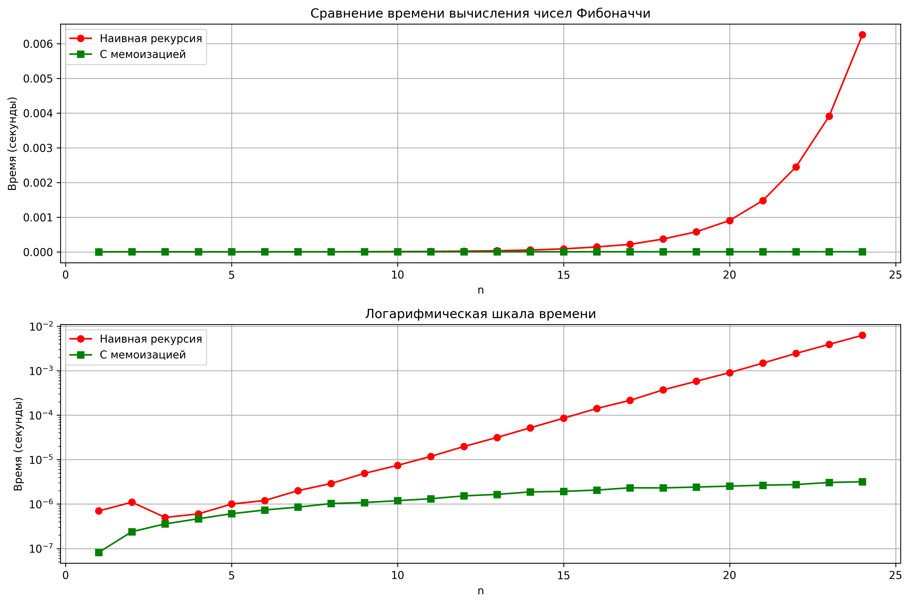

## Отчет к лабораторной работе № 3   
---
**Дата:** 2025-10-06  
**Семестр:** 3 курс 1 полугодие - 5 семестр  
**Группа:** ПИЖ-б-о-23-1  
**Дисциплина:** Анализ сложности алгоритмов   
**Студентка:** Журавлева Софья Витальевна   
**Репозиторий Git:** https://github.com/lookitsssonya/pizh2311-zhuravleva  
---
## Цель работы:
Цель работы: Освоить принцип рекурсии, научиться анализировать рекурсивные алгоритмы и
понимать механизм работы стека вызовов. Изучить типичные задачи, решаемые рекурсивно, и освоить
технику мемоизации для оптимизации рекурсивных алгоритмов. Получить практические навыки
реализации и отладки рекурсивных функций.
---
## Теория (кратко):  
**Рекурсия:** Процесс, при котором функция прямо или косвенно вызывает саму себя для решения
задачи.   
**Базовый случай (условие выхода):** Обязательное условие, которое прекращает рекурсивные
вызовы и предотвращает зацикливание.   
**Рекурсивный шаг:** Шаг, на котором задача разбивается на более простую подзадачу того же
типа и производится рекурсивный вызов.   
**Глубина рекурсии:** Количество вложенных вызовов функции. Ограничена размером стека
вызовов.   
**Стек вызовов (Call Stack):** Структура данных, которая хранит информацию о незавершенных
вызовах функций (локальные переменные, адрес возврата).
**Мемоизация (Memoization):** Техника оптимизации, позволяющая избежать повторных
 вычислений результатов функций для одних и тех же входных данных путем сохранения ранее
 вычисленных результатов в кеше (например, в словаре).   
---
## Практическая часть
### Выполненные задачи:
 1. Реализованы классические рекурсивные алгоритмы.
 2. Проведен анализ их временной сложности и глубины рекурсии.
 3. Реализована оптимизация рекурсивных алгоритмов с помощью мемоизации.
 4. Проведен сравнительный анализ производительности наивной рекурсии и рекурсии с мемоизацией.
 5. Решены практические задачи с применением рекурсии.
---
### Ключевые фрагменты кода <br></br>
Наивная и мемоизированная версии Фибоначчи:   
*recursion.py:*
```python
def fibonacci_naive(n: int) -> int:
    if n < 0:
        raise ValueError('Номер числа Фибоначчи должен быть неотрицательным')
    if n == 0:
        return 0
    if n == 1:
        return 1
    return fibonacci_naive(n - 1) + fibonacci_naive(n - 2)
```   
*memoization.py:*   
```python
def fibonacci_memo(fib_n: int, memo_dict: Dict[int, int] = None) -> int:
    if memo_dict is None:
        memo_dict = {}

    if fib_n in memo_dict:
        return memo_dict[fib_n]

    if fib_n == 0:
        return 0
    if fib_n == 1:
        return 1

    memo_dict[fib_n] = (
        fibonacci_memo(fib_n - 1, memo_dict) +
        fibonacci_memo(fib_n - 2, memo_dict)
    )
    return memo_dict[fib_n]
```
---
Быстрое возведение в степень:   
*recursion.py:*
```python
def fast_power(a: float, n: int) -> float:
    if n < 0:
        raise ValueError('Показатель степени должен быть неотрицательным')
    if n == 0:
        return 1
    if n == 1:
        return a

    half_power = fast_power(a, n // 2)
    if n % 2 == 0:
        return half_power * half_power
    else:
        return a * half_power * half_power
```
Ханойские башни:   
*trecursion_tasks.py:*
```python
def hanoi_towers(num_disks: int, source_rod: str = 'A', auxiliary_rod: str = 'B', target_rod: str = 'C') -> None:
    if num_disks == 1:
        print(f'Переместить диск 1 с {source_rod} на {target_rod}')
        return

    hanoi_towers(num_disks - 1, source_rod, target_rod, auxiliary_rod)
    print(f'Переместить диск {num_disks} с {source_rod} на {target_rod}')
    hanoi_towers(num_disks - 1, auxiliary_rod, source_rod, target_rod)
```
Обход файловой системы:   
*recursion_tasks.py:*
```python
def file_system_traversal(start_path: str, level: int = 0, max_depth: Optional[int] = None) -> None:
    if max_depth is not None and level > max_depth:
        return

    try:
        entries = os.listdir(start_path)
    except PermissionError:
        print('  ' * level + f'[Доступ запрещен: {start_path}]')
        return
    except FileNotFoundError:
        print('  ' * level + f'[Путь не найден: {start_path}]')
        return

    for entry in sorted(entries):
        full_path = os.path.join(start_path, entry)

        if os.path.isdir(full_path):
            print('  ' * level + f'-- {entry}/')
            file_system_traversal(full_path, level + 1, max_depth)
        else:
            print('  ' * level + f'- {entry}')
```
---
## Результаты выполнения

### Пример работы программы
```bash
ХАРАКТЕРИСТИКИ ПК ДЛЯ ТЕСТИРОВАНИЯ:
- Процессор: Intel Core i5-13420H (2.10 GHz)
- Оперативная память: 16 GB DDR5
- ОС: Windows 11
- Python: 3.11

=== ДЕМОНСТРАЦИЯ ВСЕХ ФУНКЦИЙ ===

1. Факториал 5: 120
2. 10-е число Фибоначчи:
   Наивный метод: 55
   С мемоизацией: 55
3. Быстрое возведение в степень:
   2^10 = 1024
   3^5 = 243
4. Бинарный поиск 7 в [1, 3, 5, 7, 9, 11, 13]: индекс 3
5. Ханойские башни для 3 дисков:
Переместить диск 1 с A на C
Переместить диск 2 с A на B
Переместить диск 1 с C на B
Переместить диск 3 с A на C
Переместить диск 1 с B на A
Переместить диск 2 с B на C
Переместить диск 1 с A на C
6. Обход файловой системы (текущая директория, глубина 1):
-- __pycache__/
  - memoization.cpython-311.pyc
  - recursion.cpython-311.pyc
  - recursion_tasks.cpython-311.pyc
- fibonacci_performance.png
- main.py
- memoization.py
- recursion.py
- recursion_tasks.py

=== ЭКСПЕРИМЕНТАЛЬНОЕ ИССЛЕДОВАНИЕ ===

Результат для n=35:
Наивная версия: 9227465, время: 1.266544 сек
Мемоизированная версия: 9227465, время: 0.000008 сек
Ускорение: 160322.01 раз

--- Построение графика времени выполнения ---
График сохранен как fibonacci_performance.png

--- Анализ сложности алгоритмов ---
Наивная рекурсия Фибоначчи: O(2^n) - экспоненциальная сложность
Фибоначчи с мемоизацией: O(n) - линейная сложность
Быстрое возведение в степень: O(log n) - логарифмическая сложность
Факториал: O(n) - линейная сложность
Бинарный поиск: O(log n) - логарифмическая сложность

--- Обход файловой системы ---
Обход с максимальной глубиной 3:
-- __pycache__/
  - memoization.cpython-311.pyc
  - recursion.cpython-311.pyc
  - recursion_tasks.cpython-311.pyc
- fibonacci_performance.png
- main.py
- memoization.py
- recursion.py
- recursion_tasks.py
```
---
## Выводы
1. Мемоизация кардинально меняет временную сложность рекурсивных алгоритмов;
2. Рекурсия является универсальным инструментом для решения задач с вложенной структурой;
3. Глубина рекурсии и производительность напрямую зависят от корректности реализации базового случая и рекурсивного шага.
---
## Ответы на контрольные вопросы
1. **Что такое базовый случай и рекурсивный шаг в рекурсивной функции? Почему отсутствие базового случая приводит к ошибке?**   
Базовый случай (условие выхода): Обязательное условие, которое прекращает рекурсивные вызовы и предотвращает зацикливание.   
Рекурсивный шаг: Шаг, на котором задача разбивается на более простую подзадачу того же типа и производится рекурсивный вызов.   
Если в рекурсивной функции отсутствует базовый случай, или базовый случай никогда не достигается, функция будет вызывать себя бесконечно. 
Каждый вызов функции добавляет новый фрейм в стек вызовов. В конечном итоге, стек вызовов переполнится, что приведет к ошибке RecursionError
2. **Объясните, как работает механизм мемоизации. Как он меняет временную сложность вычисления чисел Фибоначчи по сравнению с наивной рекурсией?**   
Это метод оптимизации, который заключается в сохранении результатов выполнения "дорогих" функций и возвращении сохраненного результата при повторных 
вызовах той же функции с теми же аргументами, вместо повторного вычисления.    
В наивной рекурсивной реализации fibonacci_naive(n), для вычисления fibonacci_naive(n) нужно вычислить fibonacci_naive(n-1) и fibonacci_naive(n-2).  
Для вычисления каждого из них, в свою очередь, нужно вычислить еще два числа Фибоначчи, и так далее.  Это приводит к экспоненциальной временной сложности, 
O(2^n), потому что многие значения вычисляются повторно много раз.   
При использовании мемоизации (fibonacci_memo(n)), каждое число Фибоначчи вычисляется только один раз.  Когда функция вызывается с определенным аргументом n, 
она сначала проверяет, есть ли уже вычисленное значение для этого n в словаре memo. Если есть, оно сразу возвращается. Если нет, то вычисляется, сохраняется 
в memo и возвращается.  Это снижает временную сложность до линейной, O(n), так как каждое число Фибоначчи вычисляется не более одного раза.
3. **В чем заключается основная проблема глубокой рекурсии и как она связана со стеком вызовов?**   
Основная проблема глубокой рекурсии: Основная проблема глубокой рекурсии — это риск переполнения стека вызовов (stack overflow). Каждый раз, когда функция 
4. вызывается, в стеке вызовов создается новая запись (фрейм). Этот фрейм содержит информацию о локальных переменных функции, аргументах и адресе возврата
(куда вернуться после завершения функции).  Глубокая рекурсия означает, что функция вызывает себя много раз, прежде чем достигнет базового случая.  
Каждый рекурсивный вызов добавляет новый фрейм в стек.  Стек вызовов имеет ограниченный размер.
4. **Задача о Ханойских башнях решается рекурсивно. Опишите алгоритм решения для 3 дисков.**   
* Переместить n-1 дисков с исходного стержня на вспомогательный стержень, используя целевой стержень как вспомогательный.
* Переместить самый большой диск (n-й диск) с исходного стержня на целевой стержень.
* Переместить n-1 дисков со вспомогательного стержня на целевой стержень, используя исходный стержень как вспомогательный.
5. **Рекурсивный и итеративный алгоритмы могут решать одни и те же задачи. Назовите преимущества и недостатки каждого подхода.**  

Рекурсивный подход:   
Преимущества:   
* Более читаемый код (для задач, которые естественно выражаются рекурсивно).   
* Более короткий код.   
* Легче доказать корректность.   

Недостатки:
* Может быть менее эффективным (из-за накладных расходов на вызовы функций и управление стеком).   
* Риск переполнения стека вызовов (для глубокой рекурсии).    
* Может потреблять больше памяти.  

Итеративный подход:   
Преимущества:
* Более эффективный (обычно быстрее, чем рекурсия).   
* Не подвержен риску переполнения стека вызовов.   
* Более предсказуемое использование памяти.   

Недостатки:
* Код может быть более сложным и трудным для понимания (особенно для задач, которые естественно выражаются рекурсивно).   
* Может требовать больше кода.   
* Может быть сложнее доказать корректность.   
---
## Приложение
