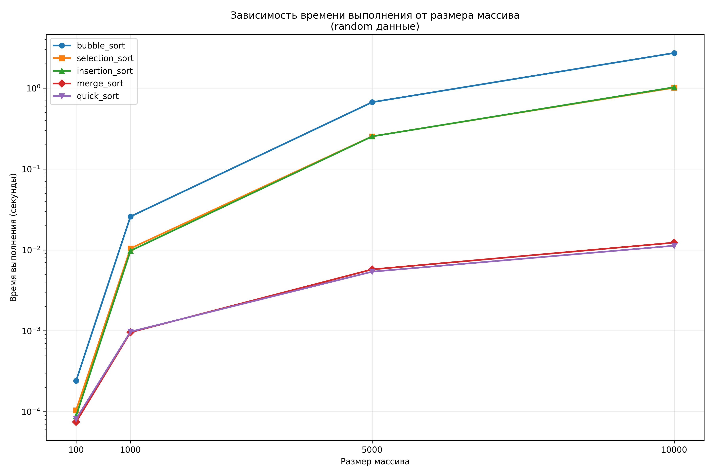
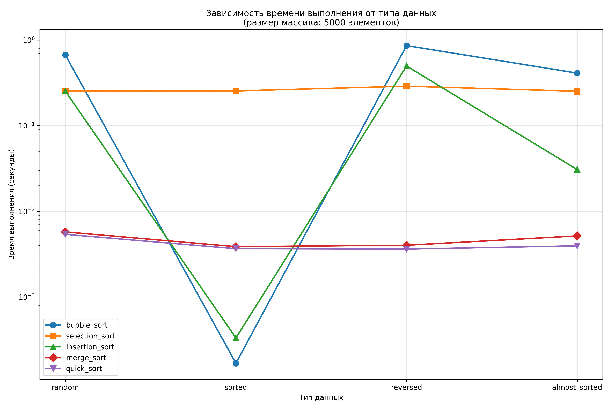

## Отчет к лабораторной работе № 4   
---
**Дата:** 2025-10-20  
**Семестр:** 3 курс 1 полугодие - 5 семестр  
**Группа:** ПИЖ-б-о-23-1  
**Дисциплина:** Анализ сложности алгоритмов   
**Студентка:** Журавлева Софья Витальевна   
**Репозиторий Git:** https://github.com/lookitsssonya/pizh2311-zhuravleva  

---
## Цель работы:
Изучить и реализовать основные алгоритмы сортировки. Провести их теоретический и
практический сравнительный анализ по временной и пространственной сложности. Исследовать
влияние начальной упорядоченности данных на эффективность алгоритмов. Получить навыки
эмпирического анализа производительности алгоритмов.

---
## Теория (кратко):  
**Сортировка пузырьком (Bubble Sort):** Многократно проходит по массиву, сравнивая и меняя
местами соседние элементы. Сложность: O(n²) во всех случаях.   
**Сортировка выбором (Selection Sort):** На каждом проходе находит минимальный элемент из
неотсортированной части и ставит его на очередную позицию. Сложность: O(n²).   
**Сортировка вставками (Insertion Sort):** Построение окончательного массива путем пошагового
вставления каждого элемента в правильную позицию в уже отсортированной части. Сложность:
O(n²) в худшем и среднем, O(n) в лучшем (уже отсортированный массив).   
**Сортировка слиянием (Merge Sort):** Рекурсивный алгоритм "разделяй и властвуй". Массив
разбивается на две части, которые сортируются рекурсивно, а затем сливаются в один
отсортированный массив. Сложность: O(n log n) во всех случаях. Требует O(n) дополнительной
памяти.   
**Быстрая сортировка (Quick Sort):** Рекурсивный алгоритм "разделяй и властвуй". Выбирается
опорный элемент, массив разделяется на элементы меньше и больше опорного, которые
сортируются рекурсивно. Сложность: O(n log n) в среднем, O(n²) в худшем случае (плохой выбор
опорного элемента). Сортировка на месте, не требует дополнительной памяти.   

---
## Практическая часть
### Выполненные задачи:
 1. Реализованы 5 алгоритмов сортировки.
 2. Проведен теоретический анализ сложности каждого алгоритма.
 3. Проведен сравнительный анализ времени выполнения алгоритмов на различных наборах данных.
 4. Проанализировано влияние начальной упорядоченности данных на эффективность сортировок.
---
### Ключевые фрагменты кода <br></br>
Сортировка пузырьком:   
*sorts.py:*
```python
def bubble_sort(arr: List[int]) -> List[int]:
    n = len(arr)
    array = arr.copy()

    for i in range(n):
        swapped = False
        for j in range(0, n - i - 1):
            if array[j] > array[j + 1]:
                array[j], array[j + 1] = array[j + 1], array[j]
                swapped = True

        if not swapped:
            break

    return array
```   
---
Сортировка выбором:   
*sorts.py:*   
```python
def selection_sort(arr: List[int]) -> List[int]:
    array = arr.copy()
    n = len(array)

    for i in range(n):
        min_idx = i
        for j in range(i + 1, n):
            if array[j] < array[min_idx]:
                min_idx = j

        array[i], array[min_idx] = array[min_idx], array[i]

    return array
```
---
Сортировка вставками:   
*sorts.py:*
```python
def insertion_sort(arr: List[int]) -> List[int]:
    array = arr.copy()

    for i in range(1, len(array)):
        key = array[i]
        j = i - 1

        while j >= 0 and array[j] > key:
            array[j + 1] = array[j]
            j -= 1

        array[j + 1] = key

    return array
```
---
Сортировка слиянием:   
*sorts.py:*
```python
def merge_sort(arr: List[int]) -> List[int]:
    if len(arr) <= 1:
        return arr.copy()

    mid = len(arr) // 2
    left = merge_sort(arr[:mid])
    right = merge_sort(arr[mid:])

    return _merge(left, right)
```
---
Быстрая сортировка:   
*sorts.py:*
```python
def quick_sort(arr: List[int]) -> List[int]:
    if len(arr) <= 1:
        return arr.copy()

    pivot = arr[len(arr) // 2]
    left = [x for x in arr if x < pivot]
    middle = [x for x in arr if x == pivot]
    right = [x for x in arr if x > pivot]

    return quick_sort(left) + middle + quick_sort(right)
```
---
## Результаты выполнения

### Пример работы программы
```bash
ХАРАКТЕРИСТИКИ ПК ДЛЯ ТЕСТИРОВАНИЯ:
- Процессор: Intel Core i5-13420H (2.10 GHz)
- Оперативная память: 16 GB DDR5
- ОС: Windows 11
- Python: 3.11

Запуск тестов для размеров: [100, 1000, 5000, 10000]

Тестирование bubble_sort...
random, размер 100: 0.000245 сек
random, размер 1000: 0.025531 сек
random, размер 5000: 0.665643 сек
random, размер 10000: 2.728968 сек
sorted, размер 100: 0.000004 сек
sorted, размер 1000: 0.000035 сек
sorted, размер 5000: 0.000162 сек
sorted, размер 10000: 0.000649 сек
reversed, размер 100: 0.000305 сек
reversed, размер 1000: 0.032709 сек
reversed, размер 5000: 0.856020 сек
reversed, размер 10000: 3.436102 сек
almost_sorted, размер 100: 0.000129 сек
almost_sorted, размер 1000: 0.014282 сек
almost_sorted, размер 5000: 0.415190 сек
almost_sorted, размер 10000: 1.749091 сек

Тестирование selection_sort...
random, размер 100: 0.000126 сек
random, размер 1000: 0.010303 сек
random, размер 5000: 0.253194 сек
random, размер 10000: 1.014308 сек
sorted, размер 100: 0.000097 сек
sorted, размер 1000: 0.010135 сек
sorted, размер 5000: 0.251206 сек
sorted, размер 10000: 1.010870 сек
reversed, размер 100: 0.000112 сек
reversed, размер 1000: 0.011441 сек
reversed, размер 5000: 0.289571 сек
reversed, размер 10000: 1.185380 сек
almost_sorted, размер 100: 0.000094 сек
almost_sorted, размер 1000: 0.010154 сек
almost_sorted, размер 5000: 0.252538 сек
almost_sorted, размер 10000: 1.003682 сек

Тестирование insertion_sort...
random, размер 100: 0.000103 сек
random, размер 1000: 0.009904 сек
random, размер 5000: 0.248641 сек
random, размер 10000: 1.029946 сек
sorted, размер 100: 0.000006 сек
sorted, размер 1000: 0.000054 сек
sorted, размер 5000: 0.000279 сек
sorted, размер 10000: 0.000619 сек
reversed, размер 100: 0.000207 сек
reversed, размер 1000: 0.019148 сек
reversed, размер 5000: 0.502079 сек
reversed, размер 10000: 2.023145 сек
almost_sorted, размер 100: 0.000018 сек
almost_sorted, размер 1000: 0.001340 сек
almost_sorted, размер 5000: 0.033776 сек
almost_sorted, размер 10000: 0.130440 сек

Тестирование merge_sort...
random, размер 100: 0.000074 сек
random, размер 1000: 0.000948 сек
random, размер 5000: 0.005707 сек
random, размер 10000: 0.012256 сек
sorted, размер 100: 0.000056 сек
sorted, размер 1000: 0.000657 сек
sorted, размер 5000: 0.004053 сек
sorted, размер 10000: 0.008161 сек
reversed, размер 100: 0.000060 сек
reversed, размер 1000: 0.000680 сек
reversed, размер 5000: 0.004067 сек
reversed, размер 10000: 0.008502 сек
almost_sorted, размер 100: 0.000064 сек
almost_sorted, размер 1000: 0.000873 сек
almost_sorted, размер 5000: 0.005155 сек
almost_sorted, размер 10000: 0.010989 сек

Тестирование quick_sort...
random, размер 100: 0.000086 сек
random, размер 1000: 0.000971 сек
random, размер 5000: 0.005541 сек
random, размер 10000: 0.011112 сек
sorted, размер 100: 0.000062 сек
sorted, размер 1000: 0.000621 сек
sorted, размер 5000: 0.003549 сек
sorted, размер 10000: 0.007280 сек
reversed, размер 100: 0.000062 сек
reversed, размер 1000: 0.000628 сек
reversed, размер 5000: 0.003906 сек
reversed, размер 10000: 0.007421 сек
almost_sorted, размер 100: 0.000066 сек
almost_sorted, размер 1000: 0.000739 сек
almost_sorted, размер 5000: 0.004060 сек
almost_sorted, размер 10000: 0.007756 сек

Сводная таблица результатов
RANDOM:
------------------------------------------------------------
Алгоритм          100     1000    5000    10000
------------------------------------------------------------
bubble_sort      0.0002  0.0255  0.6656  2.7290
selection_sort   0.0001  0.0103  0.2532  1.0143
insertion_sort   0.0001  0.0099  0.2486  1.0299
merge_sort       0.0001  0.0009  0.0057  0.0123
quick_sort       0.0001  0.0010  0.0055  0.0111

SORTED:
------------------------------------------------------------
Алгоритм          100     1000    5000    10000
------------------------------------------------------------
bubble_sort      0.0000  0.0000  0.0002  0.0006
selection_sort   0.0001  0.0101  0.2512  1.0109
insertion_sort   0.0000  0.0001  0.0003  0.0006
merge_sort       0.0001  0.0007  0.0041  0.0082
quick_sort       0.0001  0.0006  0.0035  0.0073

REVERSED:
------------------------------------------------------------
Алгоритм          100     1000    5000    10000
------------------------------------------------------------
bubble_sort      0.0003  0.0327  0.8560  3.4361
selection_sort   0.0001  0.0114  0.2896  1.1854
insertion_sort   0.0002  0.0191  0.5021  2.0231
merge_sort       0.0001  0.0007  0.0041  0.0085
quick_sort       0.0001  0.0006  0.0039  0.0074

ALMOST_SORTED:
------------------------------------------------------------
Алгоритм          100     1000    5000    10000
------------------------------------------------------------
bubble_sort      0.0001  0.0143  0.4152  1.7491
selection_sort   0.0001  0.0102  0.2525  1.0037
insertion_sort   0.0000  0.0013  0.0338  0.1304
merge_sort       0.0001  0.0009  0.0052  0.0110
quick_sort       0.0001  0.0007  0.0041  0.0078


Результаты сохранены в файлы:
- results_detailed.csv
- time_vs_size_random.png
- time_vs_datatype_size_5000.png
```
---
## Выводы
1. Сортировка пузырьком применима для очень маленьких отсортираванных или хотя бы частично отсортированных массивах, когда важна простота реализации, а не производительность;
2. Сортировка выбором практически не зависит от упорядоченности данных и применима на небольших массивах до 500 элементов, когда важна простота реализации и предсказуемость времени выполнения;
3. Сортировка вставками применима для обработки упорядоченных или почти упорядоченных массивов;
4. Сортировка слиянием показыввает стабильную хорошую производительность во всех случаях. Подходит для больших массивов, где требуется гарантированная производительность;
5. Быстрая сортировка показывает хорошую производительность во всех случаях.
---
## Ответы на контрольные вопросы
1. **Какие алгоритмы сортировки имеют сложность O(n²) в худшем случае, а какие - O(n log n)?**   

Алгоритмы сортировки со сложностью O(n²) в худшем случае:
* Сортировка пузырьком (Bubble Sort)
* Сортировка выбором (Selection Sort)
* Сортировка вставками (Insertion Sort)    

Алгоритмы сортировки со сложностью O(n log n):   
* Сортировка слиянием (Merge Sort)
* Быстрая сортировка (Quick Sort) имеет среднюю сложность O(n log n), но в худшем случае (зависит от выбора опорного элемента) ее сложность может деградировать до O(n²).
---
2. **Почему сортировка вставками (Insertion Sort) эффективна для маленьких или почти отсортированных массивов?**   

Insertion Sort - простой алгоритм с небольшим количеством операций. Для небольших массивов эта простота перевешивает асимптотическую сложность.
В почти отсортированном массиве каждый элемент находится недалеко от своей окончательной позиции, поэтому Insertion Sort требует небольшого числа сравнений и перестановок. В лучшем случае (когда массив уже отсортирован) Insertion Sort работает за O(n).

---
3. **В чем разница между устойчивой (stable) и неустойчивой (unstable) сортировкой? Приведите пример устойчивого и неустойчивого алгоритма.**   

Устойчивая сортировка - это алгоритм, который сохраняет относительный порядок элементов с одинаковыми ключами. Если два элемента имеют одинаковое значение, то после сортировки их порядок будет таким же, как и до сортировки.
Например, сортировка слиянием (Merge Sort).
Неустойчивая сортировка может изменить относительный порядок элементов с одинаковыми ключами.
Например, быстрая сортировка (Quick Sort) (в большинстве реализаций), сортировка выбором (Selection Sort).   

---
4. **Опишите принцип работы алгоритма быстрой сортировки (Quick Sort). Что такое "опорный элемент" и как его выбор влияет на производительность?.**   
* Выбирается элемент из массива, который будет служить "точкой разделения".
* Элементы массива переупорядочиваются таким образом, чтобы все элементы, меньшие опорного, оказались слева от него, а все элементы, большие опорного, - справа. После разделения опорный элемент занимает свое окончательное положение в отсортированном массиве.
* Рекурсивно применяется Quick Sort к подмассивам слева и справа от опорного элемента.   

Влияние выбора опорного элемента:   
Удачный выбор - если опорный элемент близок к медиане массива, разделение будет сбалансированным, и Quick Sort будет работать за O(n log n).   
Неудачный выбор -если опорный элемент является минимальным или максимальным в массиве, разделение будет несбалансированным, и Quick Sort будет работать за O(n²).

---
5. **Сортировка слиянием (Merge Sort) гарантирует время O(n log n), но требует дополнительной памяти. В каких ситуациях этот алгоритм предпочтительнее быстрой сортировки?**  

Сортировка слиянием (Merge Sort) предпочтительнее быстрой сортировки (Quick Sort) в следующих случаях:
* Гарантированная производительность. Merge Sort всегда обеспечивает время O(n log n), в то время как Quick Sort может деградировать до O(n²).
* Устойчивость. Merge Sort является устойчивым алгоритмом, что важно в некоторых приложениях.
* Сортировка связанных списков. Merge Sort хорошо подходит для сортировки связанных списков, так как не требует частого произвольного доступа к элементам. 
* Когда важна предсказуемость времени выполнения. В ситуациях, когда критично иметь гарантированное время выполнения, Merge Sort предпочтительнее Quick Sort.   
---
## Приложение



