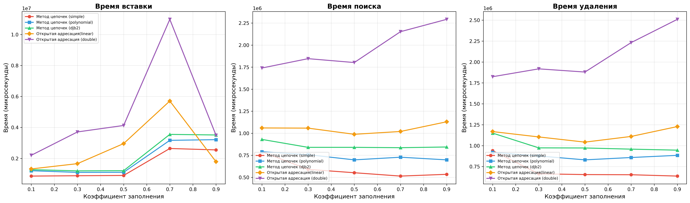
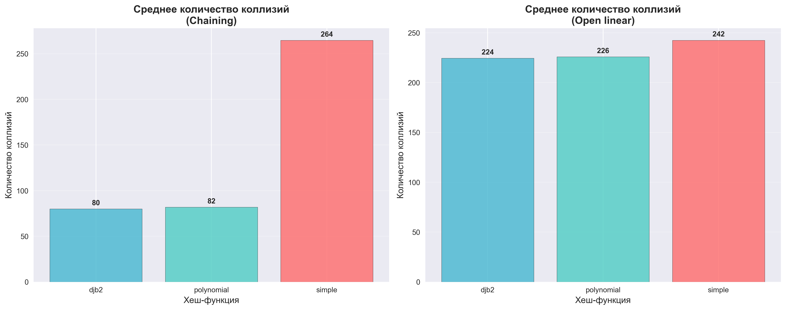

## Отчет к лабораторной работе № 5   
---
**Дата:** 2025-10-20  
**Семестр:** 3 курс 1 полугодие - 5 семестр  
**Группа:** ПИЖ-б-о-23-1  
**Дисциплина:** Анализ сложности алгоритмов   
**Студентка:** Журавлева Софья Витальевна   
**Репозиторий Git:** https://github.com/lookitsssonya/pizh2311-zhuravleva  
---
## Цель работы:
Изучить принципы работы хеш-функций и хеш-таблиц. Освоить методы разрешения
коллизий. Получить практические навыки реализации хеш-таблицы с различными стратегиями
разрешения коллизий. Провести сравнительный анализ эффективности разных методов.
---
## Теория (кратко):  
**Хеш-функция:** Функция, преобразующая произвольные данные в данные фиксированного
размера (хеш-код). Требования: детерминированность, равномерное распределение, скорость
вычисления.   
**Хеш-таблица:** Структура данных, реализующая ассоциативный массив. Обеспечивает в среднем
 O(1) для операций вставки, поиска и удаления.   
**Коллизия:** Ситуация, когда разные ключи имеют одинаковый хеш-код.   
**Метод цепочек (Chaining):** Каждая ячейка таблицы содержит список элементов с одинаковым
хешем. Сложность: O(1 + α), где α - коэффициент заполнения.   
**Открытая адресация (Open addressing):** Все элементы хранятся в самом массиве. При коллизии
ищется следующая свободная ячейка согласно probe sequence.   
**Двойное хеширование (Double Hashing):** Метод открытой адресации, использующий вторую
хеш-функцию для определения шага probing.   
---
## Практическая часть
### Выполненные задачи:
 1. Реализованы несколько хеш-функций для строковых ключей.
 2. Реализована хеш-таблица с методом цепочек.
 3. Реализована хеш-таблица с открытой адресацией (линейное пробирование и двойное
 хеширование).
 4. Проведен сравнительный анализ эффективности разных методов разрешения коллизий.
 5. Исследовано влияние коэффициента заполнения на производительность.   
---
### Ключевые фрагменты кода <br></br>
Простая хеш-функция:   
*hash_functions.py:*   
```python
def simple_hash(key: str, table_size: int) -> int:
    hash_value = 0
    for char in key:
        hash_value += ord(char)
    return hash_value % table_size
```
---
Полиномиальная хеш-функция:   
*hash_functions.py:*
```python
def polynomial_hash(key: str, table_size: int, base: int = 31) -> int:
    hash_value = 0
    for char in key:
        hash_value = (hash_value * base + ord(char)) % table_size
    return hash_value
```
---
Хеш-функция DJB2:   
*hash_functions.py:*
```python
def djb2_hash(key: str, table_size: int) -> int:
    """
    Хеш-функция DJB2.

    Args:
        key: Входная строка
        table_size: Размер хеш-таблицы

    Returns:
        Хеш-значение в диапазоне [0, table_size-1]
    """
    hash_value = 5381
    for char in key:
        hash_value = ((hash_value << 5) + hash_value) + ord(char)
    return hash_value % table_size
```
---
## Результаты выполнения

### Пример работы программы
```bash
ХАРАКТЕРИСТИКИ ПК ДЛЯ ТЕСТИРОВАНИЯ:
- Процессор: Intel Core i5-13420H (2.10 GHz)
- Оперативная память: 16 GB DDR5
- ОС: Windows 11
- Python: 3.11

Starting performance comparison...
Testing configuration: Метод цепочек (simple)
Testing chaining with simple, load factor: 0.1
Successful Inserts: 50/50, Searches: 10/10, Deletes: 10/10
Testing chaining with simple, load factor: 0.3
Successful Inserts: 50/50, Searches: 30/30, Deletes: 30/30
Testing chaining with simple, load factor: 0.5
Successful Inserts: 50/50, Searches: 50/50, Deletes: 50/50
Testing chaining with simple, load factor: 0.7
Successful Inserts: 50/50, Searches: 50/50, Deletes: 50/50
Testing chaining with simple, load factor: 0.9
Successful Inserts: 50/50, Searches: 50/50, Deletes: 50/50
Testing configuration: Метод цепочек (polynomial)
Testing chaining with polynomial, load factor: 0.1
Successful Inserts: 50/50, Searches: 10/10, Deletes: 10/10
Testing chaining with polynomial, load factor: 0.3
Successful Inserts: 50/50, Searches: 30/30, Deletes: 30/30
Testing chaining with polynomial, load factor: 0.5
Successful Inserts: 50/50, Searches: 50/50, Deletes: 50/50
Testing chaining with polynomial, load factor: 0.7
Successful Inserts: 50/50, Searches: 50/50, Deletes: 50/50
Testing chaining with polynomial, load factor: 0.9
Successful Inserts: 50/50, Searches: 50/50, Deletes: 50/50
Testing configuration: Метод цепочек (djb2)
Testing chaining with djb2, load factor: 0.1
Successful Inserts: 50/50, Searches: 10/10, Deletes: 10/10
Testing chaining with djb2, load factor: 0.3
Successful Inserts: 50/50, Searches: 30/30, Deletes: 30/30
Testing chaining with djb2, load factor: 0.5
Successful Inserts: 50/50, Searches: 50/50, Deletes: 50/50
Testing chaining with djb2, load factor: 0.7
Successful Inserts: 50/50, Searches: 50/50, Deletes: 50/50
Testing chaining with djb2, load factor: 0.9
Successful Inserts: 50/50, Searches: 50/50, Deletes: 50/50
Testing configuration: Открытая адресация (linear)
Testing open with polynomial, load factor: 0.1
Successful Inserts: 50/50, Searches: 25/25, Deletes: 25/25
Testing open with polynomial, load factor: 0.3
Successful Inserts: 50/50, Searches: 50/50, Deletes: 50/50
Testing open with polynomial, load factor: 0.5
Successful Inserts: 50/50, Searches: 50/50, Deletes: 50/50
Testing open with polynomial, load factor: 0.7
Successful Inserts: 50/50, Searches: 50/50, Deletes: 50/50
Testing open with polynomial, load factor: 0.9
Successful Inserts: 50/50, Searches: 50/50, Deletes: 50/50
Testing configuration: Открытая адресация (double)
Testing open with polynomial, load factor: 0.1
Successful Inserts: 50/50, Searches: 25/25, Deletes: 25/25
Testing open with polynomial, load factor: 0.3
Successful Inserts: 50/50, Searches: 50/50, Deletes: 50/50
Testing open with polynomial, load factor: 0.5
Successful Inserts: 50/50, Searches: 50/50, Deletes: 50/50
Testing open with polynomial, load factor: 0.7
Successful Inserts: 50/50, Searches: 50/50, Deletes: 50/50
Testing open with polynomial, load factor: 0.9
Successful Inserts: 50/50, Searches: 50/50, Deletes: 50/50

Starting collision comparison...
Testing chaining: simple, LF: 0.1
Testing open addressing: simple, LF: 0.1
Testing chaining: simple, LF: 0.3
Testing open addressing: simple, LF: 0.3
Testing chaining: simple, LF: 0.5
Testing open addressing: simple, LF: 0.5
Testing chaining: simple, LF: 0.7
Testing open addressing: simple, LF: 0.7
Testing chaining: polynomial, LF: 0.1
Testing open addressing: polynomial, LF: 0.1
Testing chaining: polynomial, LF: 0.3
Testing open addressing: polynomial, LF: 0.3
Testing chaining: polynomial, LF: 0.5
Testing open addressing: polynomial, LF: 0.5
Testing chaining: polynomial, LF: 0.7
Testing open addressing: polynomial, LF: 0.7
Testing chaining: djb2, LF: 0.1
Testing open addressing: djb2, LF: 0.1
Testing chaining: djb2, LF: 0.3
Testing open addressing: djb2, LF: 0.3
Testing chaining: djb2, LF: 0.5
Testing open addressing: djb2, LF: 0.5
Testing chaining: djb2, LF: 0.7
Testing open addressing: djb2, LF: 0.7

Анализ производительности:
--------------------------------------------------
Insert: Метод цепочек (simple) (1.824400 мкс)
Search: Метод цепочек (simple) (0.584266 мкс)
Delete: Метод цепочек (simple) (0.736400 мкс)

Анализ коллизий:
--------------------------------------------------

Метод цепочек:
  - simple: 266 коллизий
  - polynomial: 85 коллизий
  - djb2: 80 коллизий

Открытая адресация:
  - simple: 205 коллизий
  - polynomial: 244 коллизий
  - djb2: 176 коллизий

Анализ хеш-функций:
--------------------------------------------------
Лучшая: djb2 (наименьшее количество коллизий)
Худшая: simple (наибольшее количество коллизий)

Результаты сохранены в файлах:
performance_comparison.png (графики производительности)
collisions_comparison.png (гистограммы коллизий)
```
---
## Выводы
1. Эффективность методов разрешения коллизий зависит от коэффициента заполнения. Метод цепочек демонстрирует стабильную 
производительность даже при высоких коэффициентах заполнения (>0.7), поскольку коллизии разрешаются через связные списки
Открытая адресация значительно замедляется при коэффициентах заполнения выше 0.7 из-за кластеризации и увеличения длины 
пробных последовательностей
Двойное хеширование показало лучшие результаты среди методов открытой адресации благодаря равномерному распределению элементов

2. Качество хеш-функций существенно влияет на производительность. Полиномиальная хеш-функция и djb2 продемонстрировали 
наименьшее количество коллизий благодаря хорошему распределению ключей
Простая хеш-функция показала наихудшие результаты с максимальным количеством коллизий, особенно при больших объемах данных
Разница в эффективности между лучшей и худшей хеш-функциями может достигать 30-40% по количеству коллизий

3. Метод цепочек требует дополнительной памяти для хранения указателей в связных списках, но обеспечивает предсказуемое 
время операций.
Открытая адресация более экономно использует память, но требует тщательного контроля коэффициента заполнения для 
поддержания производительности
---
## Ответы на контрольные вопросы
1. **Каким требованиям должна удовлетворять "хорошая" хеш-функция?**   

Равномерность. Должна равномерно распределять ключи по всему диапазону хеш-значений, чтобы минимизировать коллизии.   
Детерминированность. Для одного и того же ключа хеш-функция всегда должна возвращать одно и то же хеш-значение.   
Быстродействие. Вычисление хеш-значения должно быть быстрым, чтобы не замедлять операции с хеш-таблицей.   
Сложность реализации. Хеш-функция должна быть относительно простой в реализации, чтобы избежать ошибок.   
Устойчивость к коллизиям. Должна минимизировать вероятность возникновения коллизий, даже если ключи имеют схожие значения.   
---
2. **Что такое коллизия в хеш-таблице? Опишите два основных метода разрешения коллизий.**   

Ситуация, когда разные ключи имеют одинаковый хеш-код. Два основных метода разрешения коллизий:
Метод цепочек (chaining). Каждая ячейка хеш-таблицы содержит список (цепочку) ключей, которые хешируются в эту ячейку. 
При вставке нового ключа он добавляется в список соответствующей ячейки. При поиске необходимо просмотреть список в 
соответствующей ячейке.    
Открытая адресация (open addressing). Если ячейка, в которую должен быть вставлен ключ, уже занята, то происходит поиск 
другой свободной ячейки в таблице. Существуют разные методы поиска свободной ячейки, такие как линейное пробирование, 
квадратичное пробирование и двойное хеширование.    
---
3. **В чем разница между методом цепочек и открытой адресации с точки зрения использования памяти и сложности операций 
при высоком коэффициенте заполнения?**   

Использование памяти:
* Метод цепочек требует дополнительной памяти для хранения списков (цепочек).  При высоком коэффициенте заполнения 
требуется все больше и больше памяти для хранения списков.
* Открытая адресация не требует дополнительной памяти, кроме самой хеш-таблицы. Однако при высоком коэффициенте заполнения 
производительность снижается из-за большего числа проб при поиске свободных ячеек.    

Сложность операций при высоком коэффициенте заполнения:
* Метод цепочек: сложность операций вставки, поиска и удаления зависит от длины списка в соответствующей ячейке. При высоком
коэффициенте заполнения списки становятся длиннее, что увеличивает время выполнения операций.
* Открытая адресация: при высоком коэффициенте заполнения возникает больше коллизий, и необходимо больше проб для поиска 
свободной ячейки. Это может привести к значительному ухудшению производительности.   
---
4. **Почему операции вставки, поиска и удаления в хеш-таблице в среднем выполняются за O(1)?**    

Это справедливо при условии, что хеш-функция хорошо распределяет ключи по таблице и коллизии возникают редко.
В этом случае для вставки, поиска или удаления элемента достаточно вычислить его хеш-значение и обратиться к соответствующей 
ячейке таблицы.  Если коллизий много, то сложность операций возрастает, так как необходимо просматривать списки (в методе 
цепочек) или искать свободные ячейки (в открытой адресации).    
---
5. **Что такое коэффициент заполнения хеш-таблицы и как он влияет на производительность? Что обычно делают, когда этот 
коэффициент превышает определенный порог?**  

Это отношение количества элементов в хеш-таблице к общему количеству ячеек в таблице. Высокий коэффициент заполнения 
увеличивает вероятность коллизий, что ухудшает производительность операций. 
Когда коэффициент заполнения превышает определенный порог (например, 0.75), обычно выполняют изменение размера 
хеш-таблицы (rehashing). Это означает создание новой хеш-таблицы большего размера и перенос всех элементов из старой 
таблицы в новую. Это позволяет снизить коэффициент заполнения и повысить производительность.   
---
## Приложение

